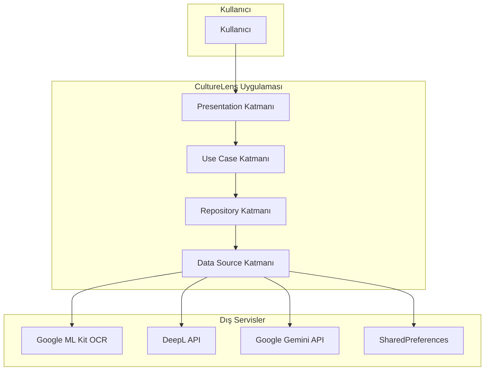
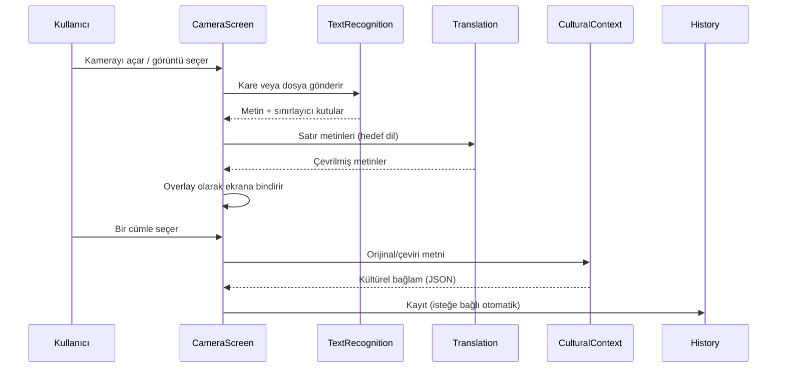
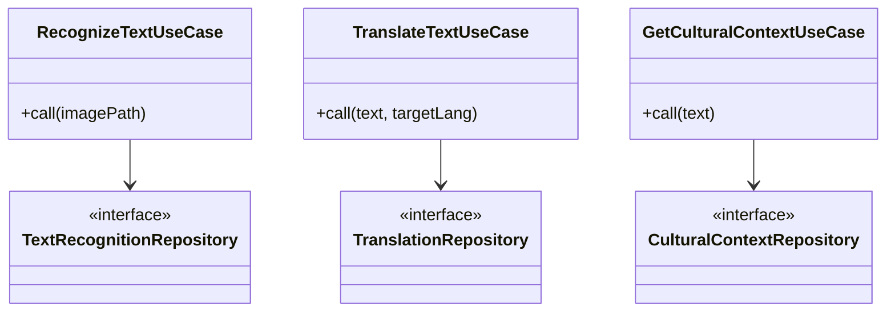

# CULTURELENS: KAMERA TABANLI AKILLI GÖRSEL ÇEVİRİ VE KÜLTÜREL BAĞLAM ASİSTANI

**Bitirme Projesi Raporu**

---

| | |
|---|---|
| **Öğrenci Adı Soyadı** | [AD SOYAD] |
| **Öğrenci Numarası** | [NUMARA] |
| **Bölüm** | [BÖLÜM ADI] |
| **Danışman** | [DANISMAN UNVAN AD SOYAD] |
| **Tarih** | Haziran 2026 |

---

## ÖZET

Günümüzde mobil çeviri uygulamaları büyük ölçüde kelime düzeyinde anlam aktarımına odaklanmakta; deyimsel, kültürel ve bağlamsal nüanslar çoğu zaman göz ardı edilmektedir. Bu bitirme projesi kapsamında **CultureLens** adlı mobil uygulama geliştirilmiştir. Uygulama, akıllı telefon kamerası aracılığıyla gerçek zamanlı optik karakter tanıma (OCR), makine çevirisi ve büyük dil modeli (LLM) destekli kültürel bağlam açıklamasını tek bir akışta birleştirmektedir.

Sistem, Flutter çerçevesi üzerinde Feature-First Clean Architecture prensipleriyle tasarlanmış; metin tanıma için Google ML Kit, çeviri için DeepL API ve kültürel bağlam üretimi için Google Gemini API kullanılmıştır. Canlı kamera modunda tanınan metinler ekran üzerinde çeviri ile birlikte bindirilerek (overlay) gösterilmekte; kullanıcı bir cümleyi seçtiğinde LLM tarafından Türkçe kültürel açıklama sunulmaktadır. Geçmiş modülü, seçilen çevirilerin yerel depolamada saklanmasını sağlamaktadır.

Deneysel değerlendirmede [DOLDUR: örn. 30 test görüntüsü] üzerinde OCR doğruluğu, çeviri gecikmesi ve kültürel bağlam kalitesi ölçülmüştür. Sonuçlar, sistemin akademik ve pratik kullanım senaryolarında uygulanabilir olduğunu göstermektedir.

**Anahtar Kelimeler:** Optik karakter tanıma, makine çevirisi, büyük dil modelleri, kültürel bağlam, Flutter, mobil uygulama

---

## İÇİNDEKİLER

1. Giriş
2. Literatür ve Mevcut Sistemler
3. Sistem Tasarımı
4. Kullanılan Teknolojiler
5. Gerçekleştirim
6. Deneysel Sonuçlar
7. Sonuç ve Gelecek Çalışmalar

Kaynakça  
Ekler

---

# 1. GİRİŞ

## 1.1. Problemin Tanımı

Küreselleşen dünyada dil bariyerleri, turizm, eğitim, ticaret ve günlük iletişimde önemli bir engel oluşturmaktadır. Akıllı telefonlara entegre çeviri uygulamaları bu engeli kısmen aşsa da çoğu sistem yalnızca sözcük veya cümle düzeyinde birebir çeviri sunmaktadır. Oysa dil; tarihsel, toplumsal ve kültürel bağlamlarla şekillenen dinamik bir iletişim aracıdır. Bir deyimin, atasözünün veya yerel bir ifadenin kelime kelime çevirisi, hedef dildeki okuyucu için yanıltıcı veya anlamsız olabilir.

Görsel çeviri senaryolarında — örneğin bir restoran menüsü, müze tabelası veya sokak levhası — kullanıcının ihtiyacı yalnızca “ne yazıyor?” sorusunun cevabı değil, aynı zamanda “bu ifade bu kültürde ne anlama geliyor?” sorusunun cevabıdır. Mevcut ticari çözümlerin önemli bir kısmı bu ikinci boyutu ya hiç ele almamakta ya da sınırlı açıklamalarla yetinmektedir.

## 1.2. Projenin Amacı

Bu projenin temel amacı, mobil cihaz kamerasını kullanarak:

1. Görüntüdeki metni anlık olarak tespit etmek (OCR),
2. Tespit edilen metni hedef dile çevirmek,
3. Çevrilen metnin arkasındaki kültürel, deyimsel veya tarihsel bağlamı bir LLM aracılığıyla kullanıcıya açıklamak

işlevlerini bir arada sunan **anlam ve kültür odaklı** bir görsel çeviri asistanı geliştirmektir.

Proje, bir yazılım mühendisliği bitirme çalışması olarak yalnızca işlevsel bir uygulama üretmeyi değil; sürdürülebilir, test edilebilir ve genişletilebilir bir yazılım mimarisi ortaya koymayı da hedeflemektedir.

## 1.3. Projenin Kapsamı

**Kapsam dahilinde:**

- Android ve iOS platformlarında çalışan Flutter tabanlı mobil uygulama
- Canlı kamera ve statik görüntü (fotoğraf çekimi / galeri) ile OCR
- DeepL API üzerinden çok dilli makine çevirisi
- Google Gemini API üzerinden kültürel bağlam üretimi
- Yerel geçmiş (history) kaydı
- Feature-First Clean Architecture ile modüler kod yapısı

**Kapsam dışında:**

- Sunucu taraflı özel model eğitimi
- Çevrimdışı (offline) tam işlevsellik
- Kullanıcı hesabı ve bulut senkronizasyonu
- Sesli çeviri ve konuşma tanıma

## 1.4. Raporun Organizasyonu

Bu rapor yedi ana bölümden oluşmaktadır. Bölüm 2’de ilgili literatür ve mevcut ticari/akademik sistemler incelenmiştir. Bölüm 3’te mimari tasarım ve veri akışı sunulmuştur. Bölüm 4’te kullanılan teknolojiler tablolaştırılmıştır. Bölüm 5’te modül bazlı gerçekleştirim detayları verilmiştir. Bölüm 6’da deneysel testler ve performans değerlendirmesi yer almaktadır. Bölüm 7’de sonuçlar özetlenmiş ve gelecek çalışmalar önerilmiştir.

---

# 2. LİTERATÜR VE MEVCUT SİSTEMLER

## 2.1. Optik Karakter Tanıma (OCR)

Optik karakter tanıma, basılı veya el yazısı metnin dijital ortama aktarılması problemine odaklanan klasik bir bilgisayarlı görü alanıdır. Geleneksel OCR yaklaşımları şablon eşleme, özellik çıkarımı ve sınıflandırıcılar üzerine kuruluyken; derin öğrenmenin yaygınlaşmasıyla birlikte evrişimli sinir ağları (CNN) ve ardından dönüştürücü (transformer) tabanlı mimariler bu alanda dominant hale gelmiştir.

Mobil platformlarda OCR uygulamaları için Google ML Kit Text Recognition, Apple Vision framework ve Tesseract gibi çözümler yaygın olarak kullanılmaktadır. ML Kit, cihaz üzerinde (on-device) çalışarak gecikmeyi düşürür ve ağ bağımlılığını azaltır; bu proje de bu avantaj nedeniyle ML Kit’i tercih etmiştir.

## 2.2. Makine Çevirisi

Makine çevirisi, istatistiksel makine çevirisinden (SMT) nöral makine çevirisine (NMT) geçişle birlikte belirgin kalite artışı göstermiştir. Günümünde DeepL, Google Translate ve Microsoft Translator gibi ticari API’ler; bağlam duyarlılığı ve akıcılık açısından kullanıcı beklentilerini karşılayan sonuçlar üretmektedir.

Ancak NMT sistemleri de kültürel göndermeleri, deyimleri ve ironiyi her zaman doğru aktaramaz. Bu nedenle çeviri çıktısının tek başına yeterli olmadığı; üst düzey dilsel açıklama katmanına ihtiyaç duyulduğu literatürde ve kullanıcı deneyimi çalışmalarında sıkça vurgulanmaktadır.

## 2.3. Büyük Dil Modelleri ve Kültürel Bağlam

GPT, Gemini ve benzeri büyük dil modelleri (LLM), geniş ölçekli metin verisi üzerinde ön-eğitim almış ve talimat izleme (instruction following) yeteneği sayesinde açıklama, özetleme ve bağlamsal yorum üretiminde güçlü performans sergilemektedir. LLM’lerin çeviri sonrası “kültürel köprü” olarak kullanılması nispeten yeni bir yaklaşımdır; akademik literatürde kültürlerarası iletişim ve yerelleştirme (localization) bağlamında bu potansiyel tartışılmaktadır.

Bu projede LLM, çeviri metnini doğrudan değiştirmek yerine tamamlayıcı bir açıklama katmanı olarak konumlandırılmıştır. Böylece çeviri motorunun deterministik doğruluğu ile LLM’in açıklayıcı gücü birbirini tamamlar.

## 2.4. Mevcut Ticari Sistemlerin Karşılaştırması

| Sistem | OCR | Çeviri | Kültürel/ Bağlamsal Açıklama | Mimari Özellik |
|--------|-----|--------|------------------------------|----------------|
| Google Translate (Kamera) | ✓ | ✓ | ✗ (sınırlı) | Kapalı kaynak, bulut tabanlı |
| Microsoft Translator | ✓ | ✓ | ✗ | Kapalı kaynak |
| DeepL (Mobil) | Kısıtlı | ✓ (yüksek kalite) | ✗ | Kapalı kaynak |
| Apple Translate | ✓ | ✓ | ✗ | Platforma özel |
| **CultureLens (Bu proje)** | ✓ (ML Kit, canlı) | ✓ (DeepL) | ✓ (Gemini LLM) | Modüler Clean Architecture |

Mevcut sistemlerin çoğu “hızlı çeviri” senaryosuna optimize edilmiştir. CultureLens ise özellikle **kültürel farkındalık** ve **eğitici açıklama** senaryosuna odaklanarak literatürdeki boşluğu pratik bir mühendislik çözümüyle doldurmayı amaçlamaktadır.

## 2.5. Mobil Yazılım Mimarisi Literatürü

Sürdürülebilir mobil uygulamalarda Clean Architecture, katmanlı bağımlılık yönetimi ve test edilebilirlik için yaygın kabul görmektedir (Martin, 2017). Feature-First organizasyon ise özellikle orta ve büyük ölçekli projelerde ekip paralelliği ve modül izolasyonu sağlar. Bu proje, akademik bir bitirme çalışması olmasına rağmen endüstriyel mimari disiplinine uygun geliştirilmiştir.

---

# 3. SİSTEM TASARIMI

## 3.1. Genel Mimari Yaklaşım

CultureLens, **Feature-First Clean Architecture** modeli ile tasarlanmıştır. Her özellik (`text_recognition`, `translation`, `cultural_context`, `history`) kendi içinde üç katmana ayrılmıştır:

| Katman | Sorumluluk | Bağımlılık Kuralı |
|--------|------------|-------------------|
| **Domain** | Entity, Repository arayüzü, Use Case | Saf Dart; dış paket yok |
| **Data** | Model, Data Source, Repository implementasyonu | Yalnızca Domain |
| **Presentation** | UI, Cubit/State | Yalnızca Domain |

Ortak yapılandırma, tema ve hata sarmalayıcıları `lib/core/` altında; navigasyon yardımcıları `lib/common/` altında konumlandırılmıştır. Bağımlılık enjeksiyonu `get_it` paketi ile `service_locator.dart` dosyasında merkezi olarak yönetilmektedir.

## 3.2. Sistem Bağlam Diyagramı



## 3.3. Veri Akışı

Uygulamanın ana iş akışı aşağıdaki sırayı izler:



### 3.3.1. Canlı Mod Akışı

Canlı kamera modunda `CameraController.startImageStream` ile gelen her kare, throttle mekanizmasıyla (varsayılan ~1,5 saniye) sınırlandırılarak işlenir. Bu tasarım kararı:

- CPU/GPU ve pil tüketimini kontrol altında tutar,
- ML Kit ve DeepL API çağrı frekansını makul seviyede tutar,
- Kullanıcı deneyiminde “anlık” hissi korunurken aşırı titremeyi (flicker) azaltır.

Her karede en fazla 8 metin satırı çevrilir; bu üst sınır arayüz karmaşıklığını ve API maliyetini sınırlar.

### 3.3.2. Statik Görüntü Akışı

Fotoğraf çekimi veya galeri seçiminde canlı akış durdurulur; görüntü dosyası OCR motoruna iletilir. EXIF yönlendirme bilgisi (`JpegOrientationReader`) ve kamera rotasyonu (`CameraImageMapper`) dikkate alınarak sınırlayıcı kutular doğru konuma haritalanır (`OcrViewportMapper`).

## 3.4. Modül Tasarımları

### 3.4.1. Text Recognition Modülü

- **Entity:** `RecognizedText`, `RecognizedTextItem`, `LiveRecognitionFrame`
- **Use Cases:** `RecognizeTextUseCase`, `RecognizeLiveFrameUseCase`
- **Data Source:** Google ML Kit `TextRecognizer` (Latin script)

### 3.4.2. Translation Modülü

- **Entity:** `TranslatedText`
- **Use Case:** `TranslateTextUseCase`
- **Data Source:** DeepL REST API (`/v2/translate`)

### 3.4.3. Cultural Context Modülü

- **Entity:** `CulturalContextEntity`
- **Use Case:** `GetCulturalContextUseCase`
- **Data Source:** Gemini `generateContent` endpoint

LLM’e yapılandırılmış JSON çıktısı talep eden bir prompt gönderilir; yanıt repository katmanında normalize edilir (markdown code fence temizleme, JSON ayrıştırma).

### 3.4.4. History Modülü

- **Entity:** `HistoryEntry` (orijinal metin, çeviri, kültürel bağlam, zaman damgası)
- **Use Cases:** `SaveHistoryEntryUseCase`, `GetHistoryEntriesUseCase`
- **Data Source:** `SharedPreferences` (JSON serileştirme, en fazla 200 kayıt)

## 3.5. Hata Yönetimi Tasarımı

Domain katmanında işlem sonuçları `Result<T>` sarmalayıcısı ile temsil edilir. Başarısızlık durumları `Failure` nesnesi ile taşınır. Bu yaklaşım:

- İstisna fırlatma yerine kontrollü hata akışı sağlar,
- Presentation katmanında tutarlı kullanıcı mesajları üretmeyi kolaylaştırır,
- API anahtarı yokluğunda mock/deterministik fallback moduna geçişi destekler.

## 3.6. Güvenlik ve Yapılandırma

API anahtarları `.env` dosyasından `flutter_dotenv` ile yüklenir. Geliştirme sürecinde kolaylık sağlasa da, üretim ortamında anahtarların istemci tarafında gömülü olmasının riskleri rapor kapsamında kabul edilmiş ve gelecek çalışmalarda backend vekil (proxy) sunucu önerilmiştir.

---

# 4. KULLANILAN TEKNOLOJİLER

## 4.1. Geliştirme Ortamı ve Çerçeveler

| Teknoloji | Sürüm / Detay | Kullanım Amacı |
|-----------|---------------|----------------|
| Flutter | SDK ^3.10.7 | Çapraz platform mobil UI |
| Dart | 3.x | Uygulama dili |
| Android Gradle | 8.14 | Android derleme |
| Xcode / CocoaPods | [DOLDUR] | iOS derleme |

## 4.2. Flutter Paketleri

| Paket | Sürüm | Rol |
|-------|-------|-----|
| `camera` | ^0.12.0 | Canlı kamera önizleme ve kare yakalama |
| `image_picker` | ^1.1.2 | Galeriden görüntü seçimi |
| `google_mlkit_text_recognition` | ^0.15.0 | Cihaz üzeri OCR |
| `flutter_bloc` | ^9.1.1 | Durum yönetimi (Cubit) |
| `get_it` | ^8.0.3 | Bağımlılık enjeksiyonu |
| `http` | ^1.6.0 | REST API iletişimi |
| `flutter_dotenv` | ^6.0.0 | Ortam değişkenleri |
| `shared_preferences` | ^2.5.3 | Yerel geçmiş depolama |

## 4.3. Harici API ve Servisler

| Servis | Sağlayıcı | Özellik |
|--------|----------|---------|
| Text Recognition | Google ML Kit | On-device, Latin script |
| Çeviri | DeepL API | Yüksek kaliteli NMT |
| Kültürel Bağlam | Google Gemini (varsayılan: `gemini-2.0-flash`) | LLM tabanlı açıklama |

## 4.4. Donanım Gereksinimleri

- Arka veya ön kamera (zorunlu)
- Android: API 21+ [DOLDUR: minimum SDK doğrulayın]
- iOS: 12.0+ [DOLDUR]
- İnternet bağlantısı (çeviri ve LLM için; OCR cihaz üzerinde)

## 4.5. Tasarım ve Kullanıcı Arayüzü

Uygulama koyu tema (`AppTheme.dark`) ile tasarlanmıştır. Renk paleti `AppColors` üzerinden merkezi yönetilir. Ana ekranda “Tara ve Çevir” kartı, hızlı işlemler (Kamera, Galeri, Geçmiş) ve kamera ekranında üst/alt kontrol çubukları bulunmaktadır.

---

# 5. GERÇEKLEŞTİRİM

## 5.1. Proje Dizin Yapısı

```
lib/
├── core/                    # Tema, env, hata sınıfları
├── common/                  # Navigasyon yardımcıları
├── features/
│   ├── text_recognition/    # OCR (domain/data/presentation)
│   ├── translation/         # DeepL çeviri
│   ├── cultural_context/    # Gemini LLM
│   ├── history/             # Yerel geçmiş
│   └── home/                # Ana sayfa bileşenleri
├── service_locator.dart     # DI yapılandırması
└── main.dart                # Uygulama giriş noktası
```

## 5.2. Uygulama Başlatma

`main.dart` içinde sırasıyla:

1. `WidgetsFlutterBinding.ensureInitialized()`
2. `EnvLoader.load()` — `.env` dosyasından API anahtarları
3. `setupServiceLocator()` — bağımlılıkların kaydı
4. `runApp(MyApp())` — `CultureLens` ana sayfası

## 5.3. Text Recognition Gerçekleştirimi

`TextRecognitionDataSourceImpl`, ML Kit’ten dönen blok ve satır yapısını dolaşarak her satır için metin ve sınırlayıcı kutu (`boundingBox`) bilgisini `RecognizedTextItemModel` olarak üretir.

Canlı kare işlemede `CameraImageMapper`:

- Android için YUV420 formatını,
- iOS için BGRA8888 formatını

`InputImage` nesnesine dönüştürür. Cihaz yönlendirmesi ve kamera lens yönü rotasyon hesabına dahil edilir.

`OcrViewportMapper` sınıfı, ML Kit koordinat sistemini ekran piksel koordinatına `BoxFit.cover` (canlı önizleme) veya `BoxFit.contain` (statik görüntü) mantığıyla haritalar. Ön kamera için yatay ayna (`mirrorHorizontal`) desteği sağlanmıştır.

## 5.4. Translation Gerçekleştirimi

`DeepLTranslationDataSource`, HTTP POST ile `/v2/translate` endpoint’ine `text`, `target_lang` alanlarını gönderir. API anahtarı yoksa deterministik mock mod devreye girer (geliştirme/test kolaylığı).

Desteklenen hedef diller arayüzde “Türkçe” ve “English” seçenekleriyle eşlenmiştir (`TR`, `EN`).

## 5.5. Cultural Context Gerçekleştirimi

`CulturalContextDataSourceImpl`, Gemini API’ye yapılandırılmış prompt gönderir:

- Çıktı yalnızca JSON olmalıdır: `{"cultural_context": "..."}`
- Açıklama dili Türkçe’dir
- `temperature: 0.2`, `maxOutputTokens: 300` ile tutarlı ve özlü yanıtlar hedeflenir

`CulturalContextRepositoryImpl`, LLM yanıtındaki markdown code fence ve gömülü JSON’u temizleyerek domain entity’sine dönüştürür.

## 5.6. History Gerçekleştirimi

Kullanıcı bir cümle seçtiğinde ve kültürel bağlam yüklendiğinde kayıt `SaveHistoryEntryUseCase` ile tetiklenir. `HistoryLocalDataSourceImpl` kayıtları JSON string listesi olarak `SharedPreferences`’a yazar; en fazla 200 giriş tutulur (FIFO mantığı).

## 5.7. CameraScreen — Entegrasyon Katmanı

`CameraScreen` (~1200+ satır), projenin en kapsamlı presentation bileşenidir. OCR, çeviri, kültürel bağlam ve geçmiş kaydını tek ekranda orkestre eder:

- **Canlı mod:** `startImageStream` → throttle → OCR → toplu çeviri → overlay
- **Statik mod:** `takePicture` veya galeri → OCR → çeviri → seçilebilir liste
- **Cümle seçimi:** `_selectSentence` → `_loadCulturalContext` → panel gösterimi
- **Sonuç paneli:** Sürükle-bırak ile daraltılabilir (collapse/expand)

Bu ekran, çoklu use case koordinasyonu gerektiğinden doğrudan domain use case’lerini enjekte eder; tek özellik cubit’inin sorumluluk alanı dışındaki işlemler için pragmatik bir orchestration yaklaşımı benimsenmiştir.

## 5.8. Bağımlılık Enjeksiyonu

`service_locator.dart` dosyasında tüm lazy singleton ve factory kayıtları tanımlıdır. Cubit’ler factory olarak kayıtlıdır (ekran başına yeni örnek); repository ve use case’ler singleton’dır.

## 5.9. Platform İzinleri

**Android** (`AndroidManifest.xml`):

- `CAMERA`
- `READ_MEDIA_IMAGES`
- `READ_EXTERNAL_STORAGE` (maxSdkVersion 32)

**iOS** (`Info.plist`):

- Kamera ve fotoğraf kütüphanesi kullanım açıklamaları [DOLDUR: eklenen anahtarları doğrulayın]

---

# 6. DENEYSEL SONUÇLAR

> **Not:** Bu bölümdeki sayısal değerler şablondur. Kendi testlerinizi yaptıktan sonra `[DOLDUR]` alanlarını gerçek ölçümlerle güncelleyin. Ekran görüntüleri Ek-A’ya eklenebilir.

## 6.1. Test Ortamı

| Parametre | Değer |
|-----------|-------|
| Test cihazı | [DOLDUR: örn. Samsung Galaxy S23 / iPhone 14] |
| İşletim sistemi | [DOLDUR: Android 14 / iOS 17] |
| Ağ | [DOLDUR: Wi-Fi / 4G] |
| Uygulama sürümü | 1.0.0+1 |
| OCR motoru | Google ML Kit Text Recognition v0.15.0 |
| Çeviri | DeepL API |
| LLM | Gemini 2.0 Flash |

## 6.2. Test Veri Seti

[DOLDUR: Test görüntülerinin kaynağını açıklayın]

Önerilen kategoriler:

1. **Menü fotoğrafları** (İngilizce, 10 örnek)
2. **Sokak tabelaları** (çok dilli, 10 örnek)
3. **Müze açıklama levhaları** (5 örnek)
4. **Deyim içeren cümleler** (5 örnek)

Toplam: **30 görüntü** [DOLDUR]

## 6.3. OCR Performansı

| Metrik | Değer |
|--------|-------|
| Karakter düzeyi doğruluk (Character Accuracy) | [DOLDUR: %] |
| Kelime düzeyi doğruluk (Word Accuracy) | [DOLDUR: %] |
| Ortalama işleme süresi (statik görüntü) | [DOLDUR: ms] |
| Ortalama işleme süresi (canlı kare) | [DOLDUR: ms] |

**Gözlem:** [DOLDUR: örn. düşük ışık koşullarında doğruluk düşüşü, eğik açıların etkisi]

## 6.4. Çeviri Performansı

| Metrik | Değer |
|--------|-------|
| Ortalama API gecikmesi (satır başına) | [DOLDUR: ms] |
| BLEU skoru (referans çeviriye karşı) | [DOLDUR: isteğe bağlı] |
| Kullanıcı değerlendirmesi (1–5 Likert) | [DOLDUR: x/5] |

## 6.5. Kültürel Bağlam Kalitesi

LLM çıktıları için 5 maddelik Likert ölçeği ile [DOLDUR: n kişi] katılımcıya anket uygulanabilir:

| Kriter | Ortalama Puan (1–5) |
|--------|---------------------|
| Doğruluk | [DOLDUR] |
| İlgililik (çeviriyle uyum) | [DOLDUR] |
| Anlaşılırlık | [DOLDUR] |
| Kültürel derinlik | [DOLDUR] |
| Genel memnuniyet | [DOLDUR] |

**Örnek çıktı:**

| Orijinal | Çeviri | Kültürel Bağlam |
|----------|--------|-----------------|
| "Piece of cake" | "Kolay iş" | [DOLDUR: Gemini çıktısı] |
| "Bon appétit" | "Afiyet olsun" | [DOLDUR] |

## 6.6. Sistem Performansı ve Kaynak Kullanımı

| Metrik | Canlı Mod | Statik Mod |
|--------|-----------|------------|
| Ortalama bellek kullanımı | [DOLDUR: MB] | [DOLDUR: MB] |
| Pil tüketimi (30 dk) | [DOLDUR: %] | [DOLDUR: %] |
| UI kare hızı (FPS) | [DOLDUR] | [DOLDUR] |

## 6.7. Hata ve Sınır Durumları

Test edilen senaryolar:

| Senaryo | Beklenen Davranış | Sonuç |
|---------|-------------------|-------|
| API anahtarı yok | Mock mod, uygulama çökmez | [DOLDUR: ✓/✗] |
| Ağ kesintisi | Hata mesajı gösterilir | [DOLDUR] |
| Metin bulunamadı | Boş overlay, bilgi mesajı | [DOLDUR] |
| Çok uzun metin | İlk 8 satır sınırlaması | [DOLDUR] |
| Ön kamera | Ayna düzeltmeli overlay | [DOLDUR] |

## 6.8. Karşılaştırmalı Değerlendirme

CultureLens ile Google Translate kamera modunun [DOLDUR: n] örnek üzerinde karşılaştırması:

| Özellik | Google Translate | CultureLens |
|---------|------------------|-------------|
| OCR hızı | [DOLDUR] | [DOLDUR] |
| Çeviri kalitesi | [DOLDUR] | [DOLDUR] |
| Kültürel açıklama | Yok | Var |
| Mimari şeffaflığı | Kapalı | Açık kaynak kod |

---

# 7. SONUÇ VE GELECEK ÇALIŞMALAR

## 7.1. Sonuç

Bu bitirme projesi kapsamında, mobil kamera girdisinden kültürel bağlam açıklamasına uzanan uçtan uca bir görsel çeviri sistemi başarıyla tasarlanmış ve uygulanmıştır. CultureLens uygulaması:

- Google ML Kit ile cihaz üzeri OCR,
- DeepL ile yüksek kaliteli makine çevirisi,
- Google Gemini ile yapılandırılmış kültürel bağlam üretimi

bileşenlerini Feature-First Clean Architecture altında birleştirmektedir.

Proje, yalnızca kullanıcıya çok dilli bir “sözlük” sunmakla kalmayıp, anlamı zenginleştiren bir açıklama katmanı ekleyerek mevcut ticari çözümlerden ayrışmaktadır. Modüler mimari sayesinde çeviri motoru veya LLM sağlayıcısı bağımsız olarak değiştirilebilir; bu da sistemin gelecekteki genişletmelerine olanak tanır.

[DOLDUR: Deneysel sonuçlardan 2–3 cümlelik özet — örn. “OCR doğruluğu %X, kullanıcı memnuniyeti Y/5 olarak ölçülmüştür.”]

## 7.2. Karşılaşılan Zorluklar

1. **Koordinat haritalama:** Kamera buffer boyutu, rotasyon ve ön kamera aynalaması nedeniyle OCR kutularının ekrana hizalanması önemli mühendislik çabası gerektirmiştir (`OcrViewportMapper`, `CameraImageMapper`).
2. **Canlı mod kaynak yönetimi:** Sürekli kare işleme pil ve ısınma sorunlarına yol açabileceğinden throttle ve satır sınırı uygulanmıştır.
3. **LLM çıktı tutarlılığı:** Gemini bazen JSON dışı veya code fence ile sarılı yanıt üretebilmektedir; repository katmanında normalizasyon katmanı bu riski azaltır.
4. **API anahtarı güvenliği:** İstemci tarafı `.env` gömme geliştirme için pratik olmakla birlikte üretim için yeterli değildir.

## 7.3. Gelecek Çalışmalar

1. **Backend vekil sunucu:** DeepL ve Gemini anahtarlarının sunucu tarafında tutulması; kimlik doğrulama ve kota yönetimi.
2. **Çevrimdışı mod:** On-device çeviri modeli (ör. TFLite / ML Kit Translate) ile temel çeviri; LLM için isteğe bağlı senkronizasyon.
3. **Çoklu script desteği:** ML Kit’in Cyrillic, CJK gibi ek script modelleriyle genişletme.
4. **Kullanıcı geri bildirimi döngüsü:** Kültürel açıklamalar için “faydalı / değil” oylaması ve kalite iyileştirmesi.
5. **AR bindirme iyileştirmesi:** Metin kutularının 3B perspektif ve hareketli kamera koşullarında stabilizasyonu.
6. **Erişilebilirlik:** VoiceOver / TalkBack desteği, yüksek kontrast modu.
7. **Otomatik kaynak dil algılama:** DeepL `source_lang` parametresi ile tam entegrasyon.

---

# KAYNAKÇA

1. Martin, R. C. (2017). *Clean Architecture: A Craftsman's Guide to Software Structure and Design*. Prentice Hall.
2. Google. (2024). *ML Kit Text Recognition Documentation*. https://developers.google.com/ml-kit/vision/text-recognition
3. DeepL SE. (2024). *DeepL API Documentation*. https://www.deepl.com/docs-api
4. Google DeepMind. (2024). *Gemini API Reference*. https://ai.google.dev/api
5. Flutter Team. (2024). *Flutter Documentation*. https://docs.flutter.dev
6. Vaswani, A., et al. (2017). "Attention Is All You Need." *NeurIPS*.
7. Bahdanau, D., Cho, K., & Bengio, Y. (2015). "Neural Machine Translation by Jointly Learning to Align and Translate." *ICLR*.
8. Hutchins, W. J. (2005). "Machine translation: A brief history." *Conference on Translation Technology*.
9. [DOLDUR: Küreselleşme / kültürlerarası iletişim kaynağı]
10. [DOLDUR: OCR mobil uygulama karşılaştırma kaynağı]

---

# EKLER

## Ek-A: Uygulama Ekran Görüntüleri

[DOLDUR: Ana sayfa, kamera ekranı, overlay, kültürel bağlam paneli, geçmiş sayfası]

## Ek-B: `.env` Yapılandırma Şablonu (Gizli Anahtarlar Hariç)

```env
DEEPL_API_KEY=your_deepl_key
GEMINI_API_KEY=your_gemini_key
GEMINI_MODEL=gemini-2.0-flash
```

## Ek-C: Sistem Mimari Sınıf Diyagramı (Özet)



## Ek-D: Kullanıcı Senaryosu (Use Case)

**Senaryo:** Turist bir İngilizce menü fotoğrafı çeker.

1. Kullanıcı ana sayfadan “Kamerayı Aç ve Tara”ya basar.
2. Menüye kamerayı yöneltir; canlı modda satırlar Türkçe overlay ile görünür.
3. “Fish and chips” satırına dokunur.
4. Alt panelde çeviri ve Gemini’den kültürel açıklama görüntülenir.
5. Kayıt otomatik olarak geçmişe eklenir.

---

*Bu belge `docs/PROJE_RAPORU.md` olarak proje deposunda tutulmaktadır. Word/PDF formatına aktarırken üniversitenizin şablonuna (kapak sayfası, sayfa numarası, yazı tipi) uygun biçimlendirme uygulayın.*
